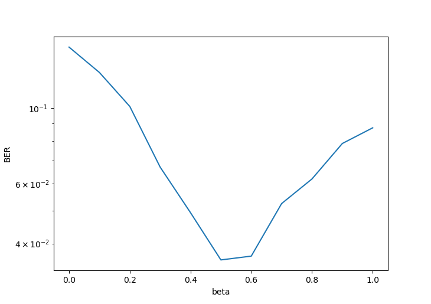
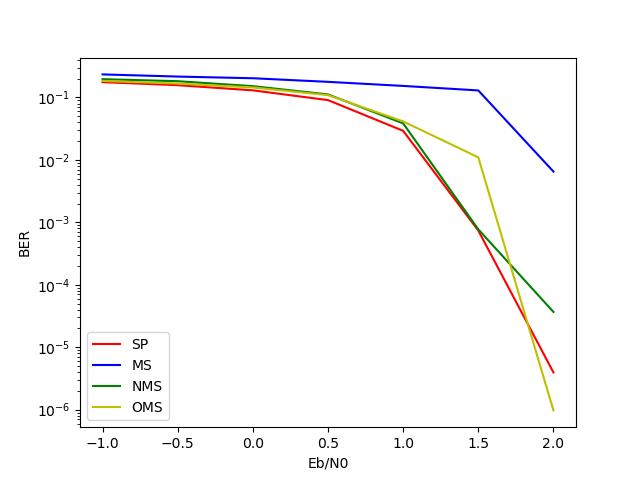
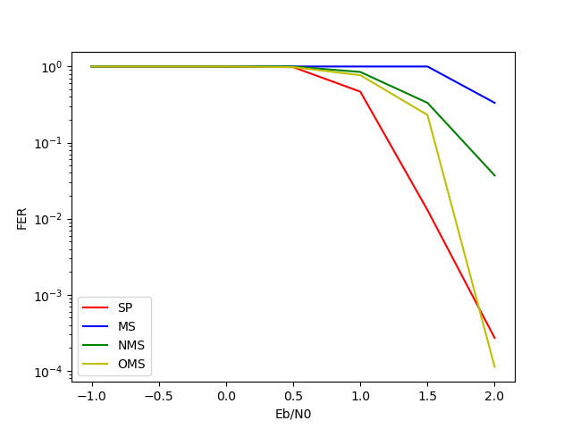

# LDPC编码大作业

苏睿 2001111334


## 1. 程序说明

程序源码位于`src`文件夹中。

`utility.py`：从文件 `Matrix(2016,1008)Block56.mat` 读取生成H矩阵

`encode.py`：编码函数 `method_1` 对应ppt中的通用方法，`method_2` 对应特定方法

`modulate.py`：实现 `BPSK`调制，`awgn`信道

`decode.py`：`LLR` 计算接受信号的对数似然比，`SP` 为和积算法，`MS` 为最小和算法，`NMS` 为归一化最小和算法，`OMS` 为偏置最小和算法

`simulate.py`：仿真文件，`search_alpha()` 在 $ \frac{E_b}{N_0}=1dB $ 时对每个 $ \alpha $ 的取值调用`NMS`；`search_beta()`在$ \frac{E_b}{N_0}=1dB $ 时对每个 $ \beta $ 的取值调用OMS；`simulate(method)` 函数对译码方法 `method` 遍历 $\frac{E_b}{N_0}$ 的取值计算结果。每个循环的执行过程如下：

```python
s = np.random.randint(0, 2, (1, K), dtype=np.int)
x = encode.method_2(s, Hp, Hs)

y = modulate.awgn(modulate.BPSK(x), SNR)

y_llr = decode.LLR(y, sigma2).reshape(-1)
x_hat = decode.SP(y_llr, H, MAX_IT)	# SP, MS, NMS, OMS
```

​	`python simulate.py alpha` 指令执行`search_alpha()`

​	`python simulate.py beta` 指令执行`search_beta()`

​	`python simulate.py SP` 指令执行 `simulate("SP")`

​	`python simulate.py MS` 指令执行 `simulate("MS")`

​	`python simulate.py NMS` 指令执行 `simulate("NMS")`，其中 $\alpha$ 已被设置为最优值 0.7

​	`python simulate.py OMS` 指令执行 `simulate("OMS")`，其中 $\beta$ 已被设置为最优值 0.5

`data`：以上程序执行得到的结果保存到此文件夹。

`plot.py`：对 `data` 文件夹中的结果文件进行绘图。

`result.xlsx`：实验数据和仿真时间抄写到此表格中。

## 2. 性能曲线

NMS中 $\alpha$ 的取值：在 $\alpha=0.7$ 时 BER 达到最小


OMS中 $\beta$ 的取值：在 $\beta=0.5$ 时 BER 达到最小



四种译码方法的BER曲线：



四种译码方法的FER曲线：



从性能上看，大体有 SP > OMS > NMS > MS 的趋势，由于仿真时间的限制，在高信噪比时错误帧数超过3就停止仿真，结果不太准确，在2.0处 OMS 超过了 SP 。